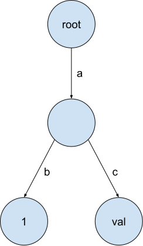
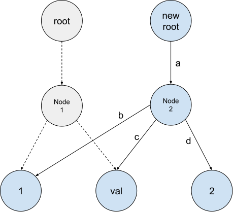
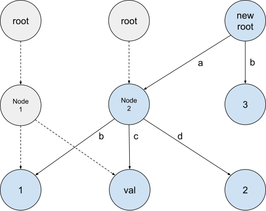
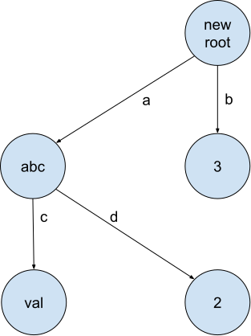
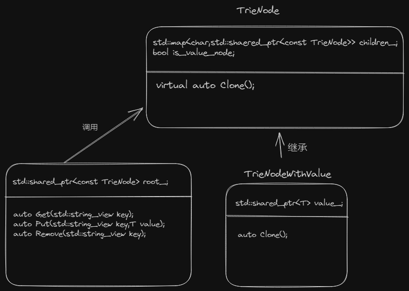
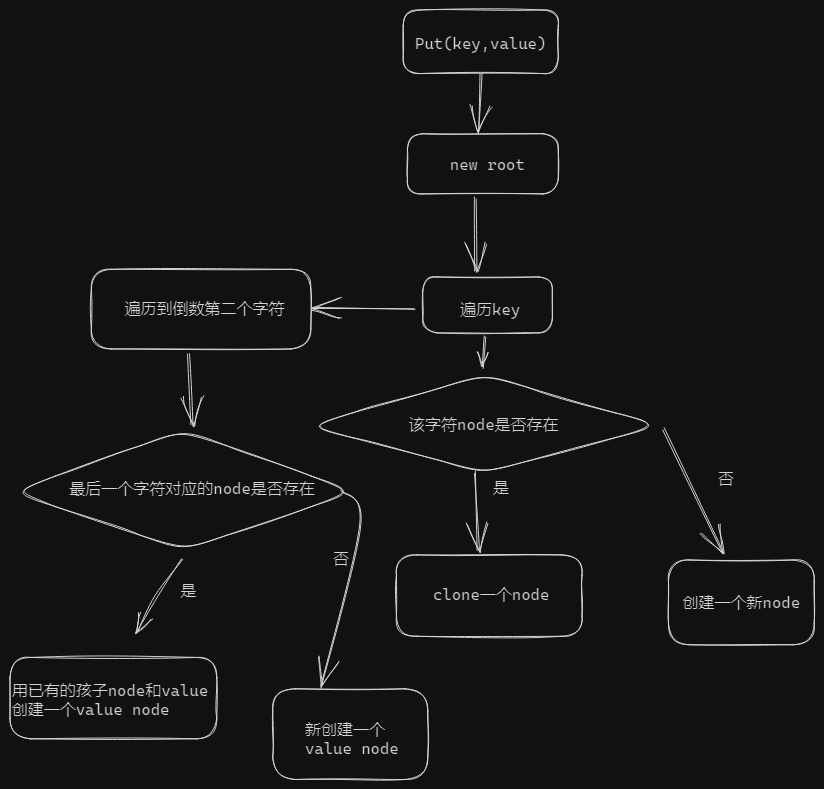
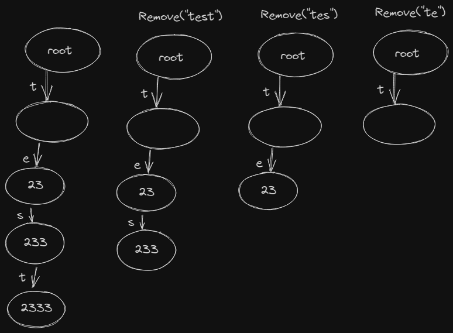
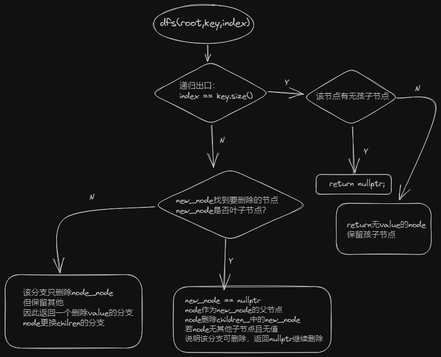

# task#1 Copy on Write Trie

## 字典树

字典树`Trie`是一种利用给定`key`检索`value`的有序树数据结构。为了简化，我们假定`key`都是可变长度字符串（但实际上可以是任何类型）。

`Trie`中每个节点可以有多个子节点，表示不同的下一个字符。


<figure><figcaption><p>key "ab"的value 1存储在左子节点，key "ac"的value val存储在右子节点</p></figcaption></figure>

## 要求

在本task中，你需要修改`trie.h`和`trie.cpp`来完成一个写时复制字典树。在写时复制字典树中，操作不会直接修改原始trie的节点，而是为修改后的数据创建新节点，返回新的root。


<figure><figcaption><p>插入("ad",2)，重用原字典树的子节点并创建新子节点2</p></figcaption></figure>


<figure><figcaption><p>插入("b",3)</p></figcaption></figure>


<figure><figcaption><p>插入("a",abc)并删除("ab",1)</p></figcaption></figure>

你的trie应支持三个操作：

* `Get(key)`：获取key对应的value。
* `Put(key,value)`：为key设置指定的value。若key已存在，则覆盖原value。注意，value的类型可能是不可复制的(`std::unique_ptr<int>`)。返回一个新trie。
* `Remove(key)`：删除key的value。返回一个新trie。（此处官网有误，以bustub代码为准）

你应创建新的trie节点并尽可能重用原有节点。

若要创建新节点，应在`TrieNode`类上使用`Clone`函数。若要重用原有节点，你可以复制`std::shared_ptr<TrieNode>`（复制一个智能指针而不是复制指向的data）。不应使用`new`和`delete`分配内存。

## 初始文件类关系图


<figure><figcaption></figcaption></figure>

## Put(key,value)

首先阅读测试用例`/test/primer/trie_test.cpp`。

```cpp
TEST(TrieTest, BasicPutTest) {
  auto trie = Trie();
  trie = trie.Put<uint32_t>("test-int", 233);
  trie = trie.Put<uint64_t>("test-int2", 23333333);
  trie = trie.Put<std::string>("test-string", "test");
  trie = trie.Put<std::string>("", "empty-key");
}
```


<figure><figcaption><p><code>Put(key,value)</code>流程图</p></figcaption></figure>

当我们插入节点，并不是在原Trie上操作，而是在一个新Trie上不断Clone新节点。采取的方法是：先遍历key到倒数第二个字符，只要原trie有对应的node，直接Clone，没有就new个TrieNode接着遍历。到最后一个字符，看原Trie有没有对应的node，若有则改为TrieNodeWithValue接管原node的chilren，若没有则new个TrieNodeWithValue。最后调用trie的构造函数返回，每次new都是调用构造函数实现。要注意两个边界条件：

* 原Trie是空树：new个root递归调用Put
* key是空串：在原Trie的root上改为TrieNodeWithValue

有关智能指针的处理可以阅读[@迷路新主楼](https://zhuanlan.zhihu.com/p/624300079)

```cpp
// Note: if you want to convert `unique_ptr` into `shared_ptr`, you can use `std::shared_ptr<T>(std::move(ptr))`.
```

## Get(key)

遍历key，若一直能找到node就强转为

```cpp
auto temp_ptr = dynamic_cast<const TrieNodeWithValue<T> *>(ptr.get());
```

获取指针，若非空就返回该指针。中途一旦没找到就返回nullptr。


## Remove(key,value)

阅读几个测试用例：

```cpp
TEST(TrieTest, BasicRemoveTest1) {
  auto trie = Trie();
  // Put something
  trie = trie.Put<uint32_t>("test", 2333);
  ASSERT_EQ(*trie.Get<uint32_t>("test"), 2333);
  trie = trie.Put<uint32_t>("te", 23);
  ASSERT_EQ(*trie.Get<uint32_t>("te"), 23);
  trie = trie.Put<uint32_t>("tes", 233);
  ASSERT_EQ(*trie.Get<uint32_t>("tes"), 233);
  // Delete something
  trie = trie.Remove("test");
  trie = trie.Remove("tes");
  trie = trie.Remove("te");

  ASSERT_EQ(trie.Get<uint32_t>("te"), nullptr);
  ASSERT_EQ(trie.Get<uint32_t>("tes"), nullptr);
  ASSERT_EQ(trie.Get<uint32_t>("test"), nullptr);
}
```


<figure><figcaption><p>BasicRemoveTest1</p></figcaption></figure>

注意点：

* 删除在新节点上操作，原trie不受影响
* 删除中间节点时要保留后续值，将`TrieNodeWithValue`改为`TrieNode`

设计一个递归函数`dfs(root,key,index)。`

&#x20;

<figure><figcaption><p>dfs(root,key,index)</p></figcaption></figure>

各种删除node的情况：


<figure><figcaption></figcaption></figure>


## Debug

测试

```sh
mkdir build
cd build
cmake -DCMAKE_BUILD_TYPE=Debug ..
make -j`nproc`

make trie_test  -j$(nproc)
./test/trie_test

# 格式化代码
make format
make check-lint
make check-clang-tidy-p0
```

一些debug记录

```cpp
// ptr = ptr->children_[ch];
// no match for ‘operator[]’
ptr = ptr->children_.at(ch);


// auto ptr = root_->Clone();
// ptr = child;
// no match for ‘operator=’ (operand types are ‘std::unique_ptr<bustub::TrieNode>’ and ‘std::shared_ptr<bustub::TrieNode>’)
std::shared_ptr<const TrieNode> ptr = root_->Clone();

// ptr = std::make_shared<const TrieNodeWithValue<T>>(ptr->children_,std::make_shared<T>(value));
// no match for ‘operator=’ (operand types are ‘std::shared_ptr<bustub::TrieNode>’ and ‘std::shared_ptr<const bustub::TrieNodeWithValue<unsigned int> >’)
ptr = std::make_shared<const TrieNodeWithValue<T>>(ptr->children_,std::make_shared<T>(std::move(value)));
```
