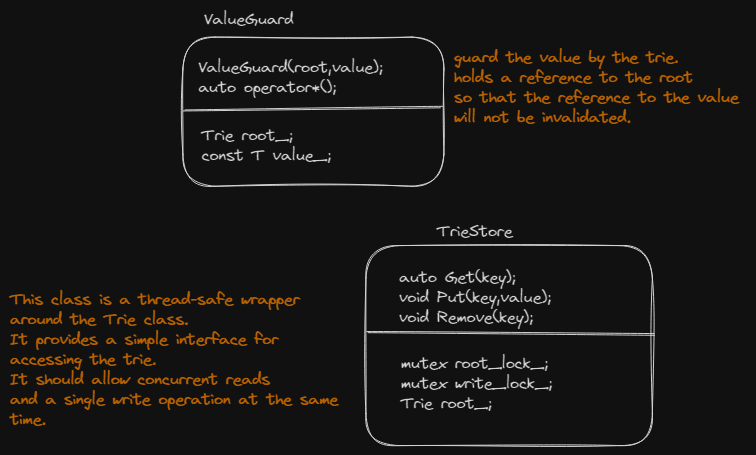

# task#2 Concurrent Key-Value Store

## 要求

将task#1的单线程写时复制字典树改为多线程，实现并发键值存储。在本task中，你需要修改`trie_store.h`和`trie_store.cpp`。该键值存储实现三个功能：

* Get(key):return the value
* Put(key,value):no return value
* Remove(key):no return value

对于task#1的`Trie`类，我们每次修改trie时，都需要获取new root来访问new content。但是对于并发键值存储，`put`和`remove`方法都是没有return value的。这需要你使用并发原语(concurrency primitives)来同步读取和写入，以便在此过程中不会丢失任何数据。

你的并发键值存储应该同时服务于多个reader和一个writer。也就是说，当有人修改trie时，仍然可以对old root进行读操作。当有人正在read时，仍然可以执行写入而无需等待read完成。

此外，如果我们从trie中获得对值的引用，则无论我们如何修改trie，我们都应该能够访问它。Trie中的`Get`函数只返回一个指针。如果存储这个值的trie节点已经被移除，指针会悬空。因此，在TrieStore中，我们返回一个ValueGuard，它既存储了对值的引用，也存储了对应于trie结构根的TrieNode，这样就可以像我们存储ValueGuard一样访问值。

为此，我们在 `trie_store.cpp` 中为您提供了 `TrieStore::Get` 的伪代码。 请仔细阅读并思考如何实现 `TrieStore::Put` 和 `TrieStore::Remove`。

## 阅读原文件

<figure><figcaption><p><code>trie_store.h</code>类关系图</p></figcaption></figure>

## Get(key)

```cpp
// Pseudo-code:
// (1) Take the root lock, get the root, and release the root lock. Don't lookup the value in the
//     trie while holding the root lock.
// (2) Lookup the value in the trie.
// (3) If the value is found, return a ValueGuard object that holds a reference to the value and the
//     root. Otherwise, return std::nullopt.
```

伪代码：

* 为root加锁，获取`TrieStore::root_`，释放锁。当root加锁时不能从trie中获取value。
* 从Trie root中调用`Trie::Get`获得value。
* 若找到value，返回一个`ValueGuard(root,value)`对象。该对象持有一个root的引用。否则，返回`std::nullopt`。

## Put(key,value)

```cpp
// You will need to ensure there is only one writer at a time. Think of how you can achieve this.
// The logic should be somehow similar to `TrieStore::Get`.
```

* 你需要确保同时只有一个writer。
* 逻辑类似`TrieStore::Get`

## Remove(key)

```cpp
// You will need to ensure there is only one writer at a time. Think of how you can achieve this.
// The logic should be somehow similar to `TrieStore::Get`.
```

* 你需要确保同时只有一个writer。
* 逻辑类似`TrieStore::Get`

其实只需要开一把大锁`TrieStore::write_lock_`，改动root时调用`TrieStore::root_lock_`即可。

## Debug

```C++
cd build
make trie_store_test -j$(nproc)
./test/trie_store_test
```
