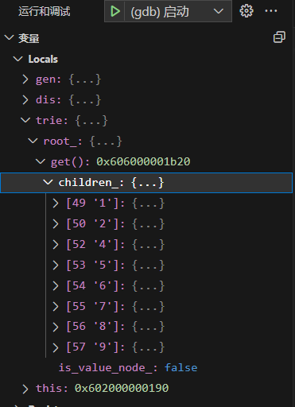
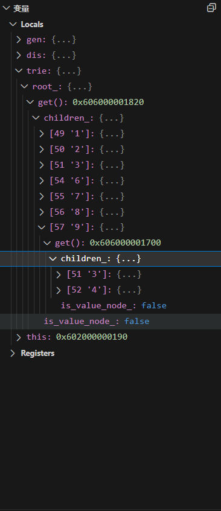

# task#3 Debugging

## 要求

在本task中，你将学习调试的基本知识。你可以选择任何你喜欢的调试方式，包括但不限于：使用cout和printf，使用CLion/VScode，gdb等。

有关说明，请阅读`trie_debug.cpp`。生成trie后需要设置断点并回答几个问题。你需要在`trie_answer.h`中填写答案。

## 阅读`trie_debug.cpp`

```cpp
TEST(TrieDebugger, TestCase) {
  std::mt19937_64 gen(2333);
  std::uniform_int_distribution<uint32_t> dis(0, 100);

  auto trie = Trie();
  for (uint32_t i = 0; i < 10; i++) {
    std::string key = fmt::format("{}", dis(gen));
    auto value = dis(gen);
    trie = trie.Put<uint32_t>(key, value);
  }

  // Put a breakpoint here.

  // (1) How many children nodes are there on the root?
  // Replace `CASE_1_YOUR_ANSWER` in `trie_answer.h` with the correct answer.
  if (CASE_1_YOUR_ANSWER != Case1CorrectAnswer()) {
    ASSERT_TRUE(false);
  }

  // (2) How many children nodes are there on the node of prefix `9`?
  // Replace `CASE_2_YOUR_ANSWER` in `trie_answer.h` with the correct answer.
  if (CASE_2_YOUR_ANSWER != Case2CorrectAnswer()) {
    ASSERT_TRUE(false);
  }

  // (3) What's the value for `93`?
  // Replace `CASE_3_YOUR_ANSWER` in `trie_answer.h` with the correct answer.
  if (CASE_3_YOUR_ANSWER != Case3CorrectAnswer()) {
    ASSERT_TRUE(false);
  }
}
```

## 步骤

在指定处设置断点进行调试，得到三个参数填入`trie_answer.h`。

使用VScode首先需要安装[gdb拓展](https://zhuanlan.zhihu.com/p/566365173)，然后需要在`CMakeLists.txt`修改生成文件，添加`src/primer/trie_debug_test.cpp`：

```cmake
set(P0_FILES
        "src/include/primer/trie_answer.h"
        "src/include/primer/trie_store.h"
        "src/include/primer/trie.h"
        "src/primer/trie_store.cpp"
        "src/primer/trie.cpp"
        "src/primer/trie_debug_test.cpp"
        "src/planner/plan_func_call.cpp"
        "src/include/execution/expressions/string_expression.h"
)
```

然后生成`trie_debug_test.cpp：`

```sh
make trie_debug_test -j$(nproc)
```

调试，观察左边变量。


<figure><figcaption><p>初始头文件生成变量</p></figcaption></figure>

但是该变量提交后不对，需要[修改头文件](https://zhuanlan.zhihu.com/p/613920859)。

修改后的变量：


<figure><figcaption></figcaption></figure>
