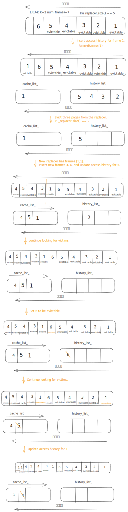
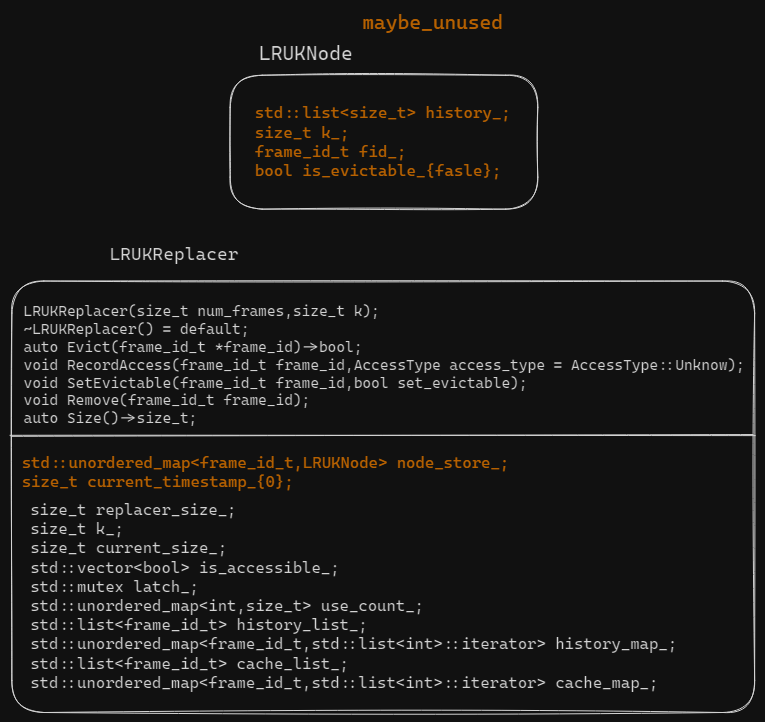
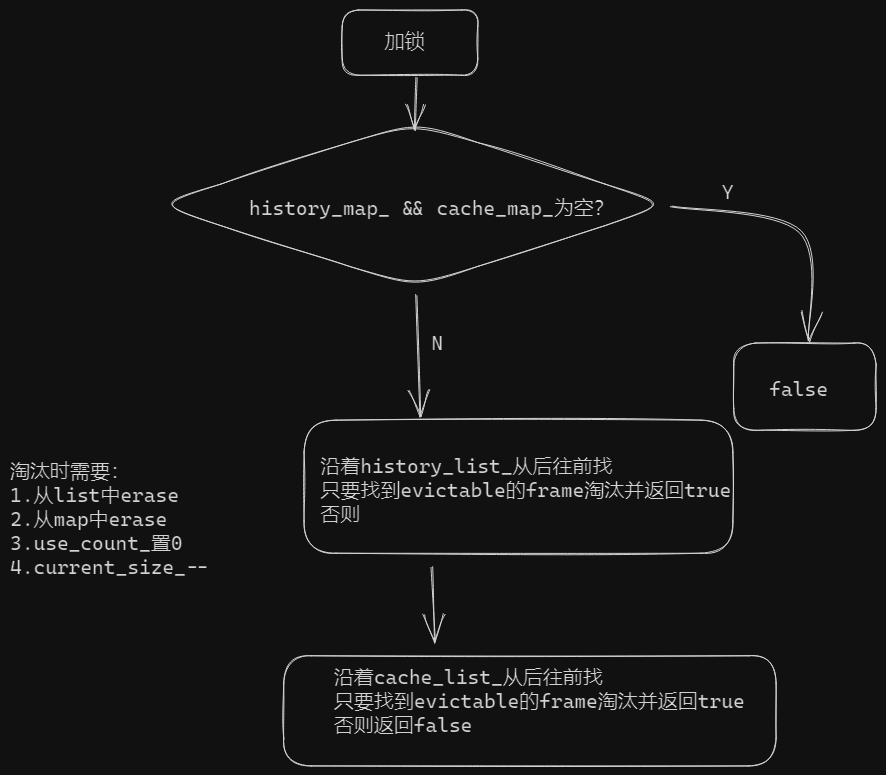

# task#1 LRU-K Replacement Policy

## 要求

该组件负责跟踪缓冲池中的页面使用情况。你将在`src/buffer/lru_k_replacer.cpp`中实现一个名为`LRUKReplacer`的新类以及其相应的实现文件。请注意`LRUKReplacer`是一个独立的类，与其他Replacer类没有关系。你只需要实现LRU-K替换策略。即使有相应的文件，你也不必实现LRU或者时钟替换策略。

LRU-K算法会淘汰在Replacer中的所有帧中后向k距离最大的帧。后向k距离是当前时间戳和第k次以前访问的时间戳之间的差值。历史访问次数少于k的帧被赋予+inf作为其后向k距离。当多个帧具有+inf的后向k距离时，Replacer将淘汰具有最早整体时间戳（最近记录的访问是所有帧中最近的访问）的帧。

你需要实现在本课程中讨论的LRU-K策略。你需要按照头文件（`src/include/buffer/lru_k_replacer.h`）和源文件（`src/buffer/lru_k_replacer.cpp`）中定义的方式实现以下方法：

* `Evict(frame_id_t* frame_id)`：淘汰具有与Replacer追踪的所有其他可淘汰帧相比具有最大后向k距离的frame。将frame id存储在输出参数中并返回True。如果没有可淘汰的frame，则返回false。
* `RecordAccess(frame_id_t frame_id)` ：记录给定的frame id在当前时间戳被访问。此方法应在页面在`BufferPoolManager`中固定之后调用。
* `Remove(frame_id_t frame_id)`：移除与frame相关联的所有访问历史记录。此方法仅在`BufferPoolManager`中删除页面时调用。
* `SetEvictable(frame_id_t frame_id, bool set_evictable)`：此方法控制frame是否可淘汰。它还控制`LRUKReplacer`的大小。当你实现`BufferPoolManager`时，将会知道何时调换此函数。具体而言，当页面的pin count达到0时，其对应的frame将会被标记为evictable，并增加Replacer的大小。
* `Size()`：此方法返回当前在`LRUKReplacer`可淘汰的帧数。

## LRU-K原理

参考阅读：

* [LRU-K和2Q缓存算法介绍](https://www.jianshu.com/p/c4e4d55706ff)
* Leetcode：[146.LRU缓存](https://leetcode.cn/problems/lru-cache/)
* SIGMOD1993：[The LRU-K Page Replacement Algorithm For Database Disk Buffering](https://www.cs.cmu.edu/\~natassa/courses/15-721/papers/p297-o\_neil.pdf)

LRU(Least Recently Used)，K表示最近使用次数。[LRU](https://zhuanlan.zhihu.com/p/161269766)是一种内存数据淘汰策略，常用于当内存不足时，淘汰最近最少使用的数据。LRU-K则是需要维护两个队列，用于记录所用缓存数据被访问的历史。

* 优先淘汰距离最大的帧
* 少于k次访问 && 距离是+inf，优先被淘汰
* 当有多个+inf时，优先淘汰整体时间戳最早的

## 阅读原文件

首先看`lru_k_replacer_test.cpp`:

```cpp
TEST(LRUKReplacerTest, DISABLED_SampleTest) {
  LRUKReplacer lru_replacer(7, 2);

  // Scenario: add six elements to the replacer. We have [1,2,3,4,5]. Frame 6 is non-evictable.
  lru_replacer.RecordAccess(1);
  lru_replacer.RecordAccess(2);
  lru_replacer.RecordAccess(3);
  lru_replacer.RecordAccess(4);
  lru_replacer.RecordAccess(5);
  lru_replacer.RecordAccess(6);
  lru_replacer.SetEvictable(1, true);
  lru_replacer.SetEvictable(2, true);
  lru_replacer.SetEvictable(3, true);
  lru_replacer.SetEvictable(4, true);
  lru_replacer.SetEvictable(5, true);
  lru_replacer.SetEvictable(6, false);
  ASSERT_EQ(5, lru_replacer.Size());

  // Scenario: Insert access history for frame 1. Now frame 1 has two access histories.
  // All other frames have max backward k-dist. The order of eviction is [2,3,4,5,1].
  lru_replacer.RecordAccess(1);

  // Scenario: Evict three pages from the replacer. Elements with max k-distance should be popped
  // first based on LRU.
  int value;
  lru_replacer.Evict(&value);
  ASSERT_EQ(2, value);
  lru_replacer.Evict(&value);
  ASSERT_EQ(3, value);
  lru_replacer.Evict(&value);
  ASSERT_EQ(4, value);
  ASSERT_EQ(2, lru_replacer.Size());

  // Scenario: Now replacer has frames [5,1].
  // Insert new frames 3, 4, and update access history for 5. We should end with [3,1,5,4]
  lru_replacer.RecordAccess(3);
  lru_replacer.RecordAccess(4);
  lru_replacer.RecordAccess(5);
  lru_replacer.RecordAccess(4);
  lru_replacer.SetEvictable(3, true);
  lru_replacer.SetEvictable(4, true);
  ASSERT_EQ(4, lru_replacer.Size());

  // Scenario: continue looking for victims. We expect 3 to be evicted next.
  lru_replacer.Evict(&value);
  ASSERT_EQ(3, value);
  ASSERT_EQ(3, lru_replacer.Size());

  // Set 6 to be evictable. 6 Should be evicted next since it has max backward k-dist.
  lru_replacer.SetEvictable(6, true);
  ASSERT_EQ(4, lru_replacer.Size());
  lru_replacer.Evict(&value);
  ASSERT_EQ(6, value);
  ASSERT_EQ(3, lru_replacer.Size());

  // Now we have [1,5,4]. Continue looking for victims.
  lru_replacer.SetEvictable(1, false);
  ASSERT_EQ(2, lru_replacer.Size());
  ASSERT_EQ(true, lru_replacer.Evict(&value));
  ASSERT_EQ(5, value);
  ASSERT_EQ(1, lru_replacer.Size());

  // Update access history for 1. Now we have [4,1]. Next victim is 4.
  lru_replacer.RecordAccess(1);
  lru_replacer.RecordAccess(1);
  lru_replacer.SetEvictable(1, true);
  ASSERT_EQ(2, lru_replacer.Size());
  ASSERT_EQ(true, lru_replacer.Evict(&value));
  ASSERT_EQ(value, 4);

  ASSERT_EQ(1, lru_replacer.Size());
  lru_replacer.Evict(&value);
  ASSERT_EQ(value, 1);
  ASSERT_EQ(0, lru_replacer.Size());

  // This operation should not modify size
  ASSERT_EQ(false, lru_replacer.Evict(&value));
  ASSERT_EQ(0, lru_replacer.Size());
}
```


<figure><figcaption><p>图示</p></figcaption></figure>

阅读`lru_k_replacer.h`


<figure><figcaption><p><code>lru_k_replacer.h</code></p></figcaption></figure>

## LRUReplacer(size\_t num\_frames,size\_t k)

`num_frames`表示需要标记`frames`的数量，用于初始化类`LRUKReplacer`的数组`is_accessible_`，初始化大小为`num_frames+1`（编号从1开始）。

`k`为`LRU-K`的`K`，初始化类`LRUKReplacer`的`k_`。

## Evict(frame\_id\_t \*frame\_id)

```cpp
  /**
   * TODO(P1): Add implementation
   *
   * @brief Find the frame with largest backward k-distance and evict that frame. Only frames
   * that are marked as 'evictable' are candidates for eviction.
   *
   * A frame with less than k historical references is given +inf as its backward k-distance.
   * If multiple frames have inf backward k-distance, then evict frame with earliest timestamp
   * based on LRU.
   *
   * Successful eviction of a frame should decrement the size of replacer and remove the frame's
   * access history.
   *
   * @param[out] frame_id id of frame that is evicted.
   * @return true if a frame is evicted successfully, false if no frames can be evicted.
   */
  auto Evict(frame_id_t *frame_id) -> bool;
```

`@brief:`

* 找到具有最大后向k距离的帧并淘汰该帧。
* 只有被标记为evictable的帧能被淘汰。
* 若一个帧少于k次历史访问，将被赋予+inf的后向k距离。若有多个帧具有inf的后向k距离，将会淘汰LRU中时间戳最早的帧。
* 若成功淘汰一个帧，那么要减小Replacer的size并返回移除frame id。要注意，由于移除frame id是\*it得到的，移除list后迭代器会失效。

`@param[out]:`

* 被淘汰的frame id

`@return:`

* 若成功淘汰一个帧，返回true。否则返回false。

<figure><figcaption><p>Evict</p></figcaption></figure>

## RecordAccess(frame\_id\_t frame\_id)

```cpp
  /**
   * TODO(P1): Add implementation
   *
   * @brief Record the event that the given frame id is accessed at current timestamp.
   * Create a new entry for access history if frame id has not been seen before.
   *
   * If frame id is invalid (ie. larger than replacer_size_), throw an exception. You can
   * also use BUSTUB_ASSERT to abort the process if frame id is invalid.
   *
   * @param frame_id id of frame that received a new access.
   * @param access_type type of access that was received. This parameter is only needed for
   * leaderboard tests.
   */
  void RecordAccess(frame_id_t frame_id, AccessType access_type = AccessType::Unknown);
```

`@brief:`

* 记录在当前时间戳下给定的frame\_id的历史访问。
* 若该frame id此前未访问过，创建一个新的访问历史。
* 若该frame id无效（大于replacer\_size\_），抛出异常。你可以使用BUSTUB\_ASSERT终止进程若该帧无效。

`@param:`

* `frame_id`给定的frame\_id
* `access_type`该参数仅在leaderboard test中需要使用。（只完成task要求不需要使用）

<figure><figcaption><p>RecordAccess</p></figcaption></figure>

## SetEvictable(frame\_id\_t frame\_id,bool set\_evictable)

```cpp
  /**
   * TODO(P1): Add implementation
   *
   * @brief Toggle whether a frame is evictable or non-evictable. This function also
   * controls replacer's size. Note that size is equal to number of evictable entries.
   *
   * If a frame was previously evictable and is to be set to non-evictable, then size should
   * decrement. If a frame was previously non-evictable and is to be set to evictable,
   * then size should increment.
   *
   * If frame id is invalid, throw an exception or abort the process.
   *
   * For other scenarios, this function should terminate without modifying anything.
   *
   * @param frame_id id of frame whose 'evictable' status will be modified
   * @param set_evictable whether the given frame is evictable or not
   */
  void SetEvictable(frame_id_t frame_id, bool set_evictable);
```

`@brief:`

* 对一个帧进行evictable与non-evictable的切换。该函数也控制current\_size\_。current\_size\_等于evictable帧的数量。
* 若一个帧此前evictable，转换为non-evictable，那么current\_size\_--。反之++。
* 若帧无效（大于replacer\_size\_），抛出异常。
* 其他情况（没访问过帧），直接返回。

## Remove(frame\_id\_t frame\_id)

```cpp
  /**
   * TODO(P1): Add implementation
   *
   * @brief Remove an evictable frame from replacer, along with its access history.
   * This function should also decrement replacer's size if removal is successful.
   *
   * Note that this is different from evicting a frame, which always remove the frame
   * with largest backward k-distance. This function removes specified frame id,
   * no matter what its backward k-distance is.
   *
   * If Remove is called on a non-evictable frame, throw an exception or abort the
   * process.
   *
   * If specified frame is not found, directly return from this function.
   *
   * @param frame_id id of frame to be removed
   */
  void Remove(frame_id_t frame_id);
```

`@brief:`

* 从replacer中按access history移除一个evictable帧。
* 若成功remove，减小current\_size\_。同时use\_count\_清零且is\_accessible\_置false。
* 注意该函数与evict不同，该函数remove指定的帧。
* 若指定帧non-evictable，抛出异常。
* 若指定帧没找到，直接返回。

## Debug

```sh
$ make lru_k_replacer_test -j$(nproc)
$ ./test/lru_k_replacer_test
```

## Format

```sh
$ make format
$ make check-lint
$ make check-clang-tidy-p1
```
