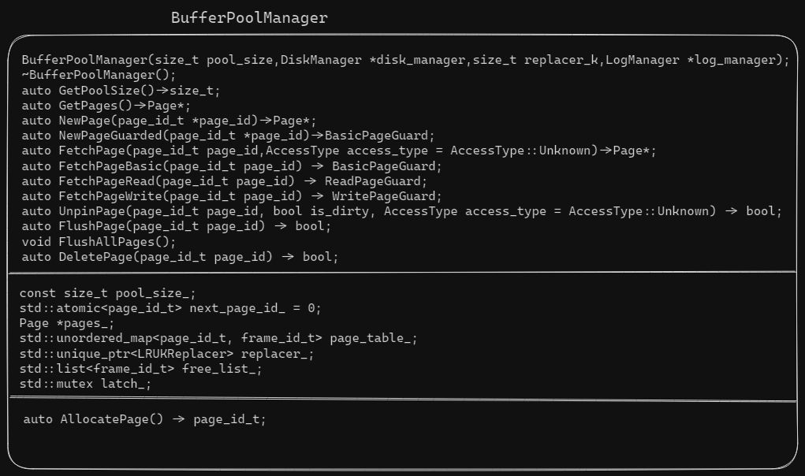
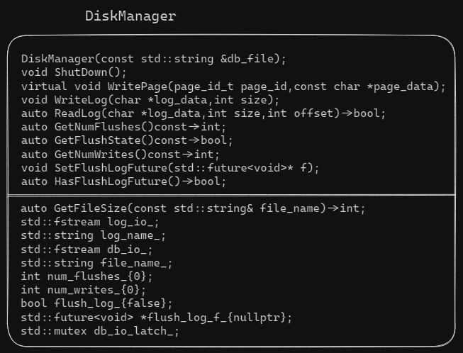
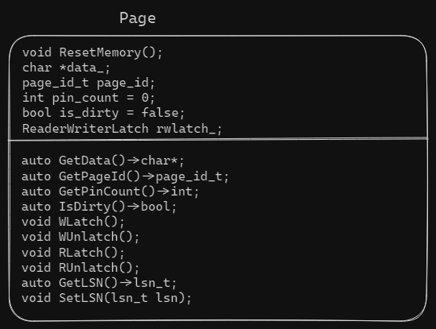
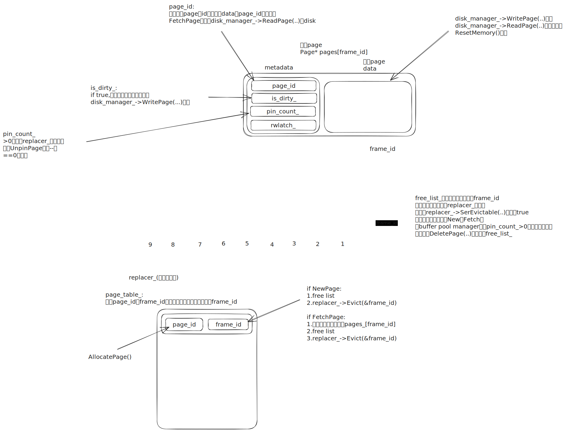
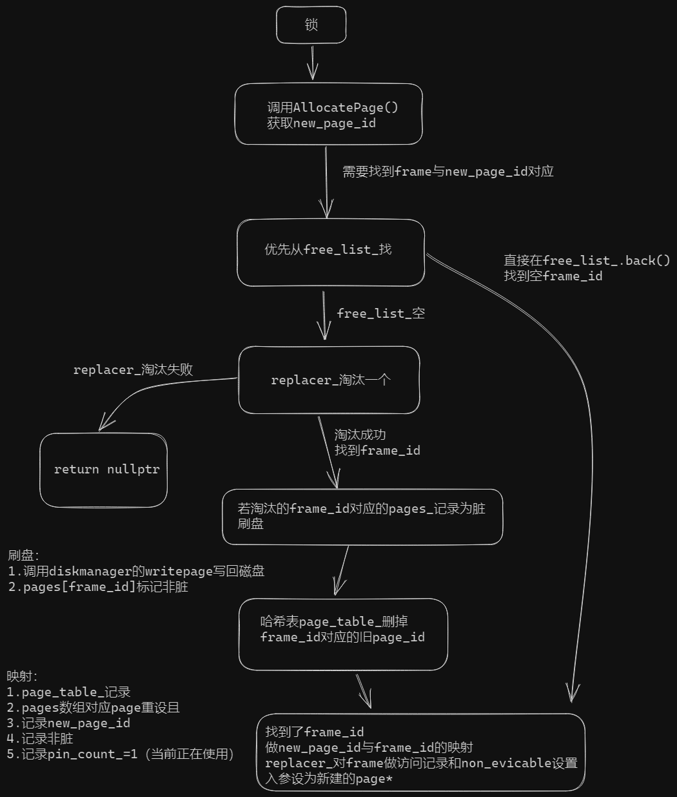
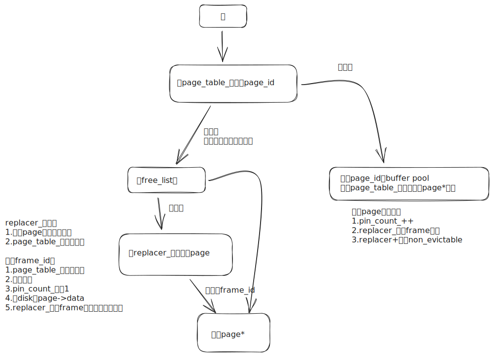

# task#2 Buffer Pool Manager

## 要求

接下来，实现缓冲池管理器。缓冲池管理器负责从`DiskManager`中获取数据库页面并将它们存储在内存中。`BufferPoolManager`还可以在当被明确要求这样做或者为新页腾出空间时，淘汰脏页。

为了确保你的实现与系统的其余部分一起正常工作，我们将为你提供一些已经完成的功能。你也不需要实现实际读取和写入磁盘数据的代码(`DiskManager`)。

系统中所有内存页面都由`Page`表示。`BufferPoolManager`不需要知道`Pages`的内容。作为系统开发人员，你需要知道`Page`只是缓冲池中内存的容器，因此并不特定于唯一的`page`。换句话说，每个Page`对象`都包含一个内存块，`DiskManager`将使用该内存块作为位置来复制它从磁盘读取的物理页面的内容。`BufferPoolManager`会重用同一个`Page`对象来存储数据，因为它在磁盘上移动。这意味着在系统的生命周期中，同一个`Page`会包含不同的物理页面。`Page`的标识符`page_id`跟踪它包含的物理页面。若`Page`对象不包含物理页面，`page_id`将被设置为`INVALID_PAGE_ID`。

每个`Page`对象还未`pinned`该页面的线程数维护一个计数器。你的`BufferPoolManger`不允许释放`pinned`页面。每个`Page`还会记录它是否脏页。你的工作是记录一个`pinned page`是否被修改。你的`BufferPoolManager`必须先把脏页的内容写回磁盘，然后才能重用该对象。

你的`BufferPoolManager`将会用到此前实现的`LRUKReplacer`类。`LRUKReplacer`会追踪`Page`对象何时被访问，以便它可以决定淘汰哪个对象。在`BufferPoolManager`中将`page_id`映射到`frame_id`时，STL是线程不安全的。

你需要实现以下函数：（头文件`src/include/buffer/buffer_pool_manager.h`，源文件`src/buffer/buffer_pool_manager.cpp`，测试文件`test/buffer/buffer_pool_manager_test.cpp`）

* `FetchPage(page_id_t page_id)`：若空闲列表中没有可用页面并且其他页面都`pinned`，则应返回`nullptr`。`FlushPage`应刷新页面，而不管其`pin`状态。
* `UnpinPage(page_id_t page_id, bool is_dirty)`：`is_dirty`参数跟踪页面在固定时是否被修改。
* `FlushPage(page_id_t page_id)`
* `NewPage(page_id_t* page_id)`
* `DeletePage(page_id_t page_id)`
* `FlushAllPages()`

当你要在`NewPage()`中创建新页面时，`AllocatePage`私有方法会提供`BufferPoolManager`唯一的新页面`ID`。Deallocate`Page()`方法是一种模拟释放磁盘页面的空操作。

## 阅读测试文件和头文件

<figure><figcaption><p><code>buffer_pool_manager.h</code></p></figcaption></figure>

<figure><figcaption><p><code>disk_manager.h</code></p></figcaption></figure>

<figure><figcaption><p><code>page.h</code></p></figcaption></figure>

<figure><figcaption><p>设计思路</p></figcaption></figure>

## NewPage(page\_id\_t \*)

```cpp
/**
 * TODO(P1): Add implementation
 *
 * @brief Create a new page in the buffer pool. Set page_id to the new page's id, or nullptr if all frames
 * are currently in use and not evictable (in another word, pinned).
 *
 * You should pick the replacement frame from either the free list or the replacer (always find from the free list
 * first), and then call the AllocatePage() method to get a new page id. If the replacement frame has a dirty page,
 * you should write it back to the disk first. You also need to reset the memory and metadata for the new page.
 *
 * Remember to "Pin" the frame by calling replacer.SetEvictable(frame_id, false)
 * so that the replacer wouldn't evict the frame before the buffer pool manager "Unpin"s it.
 * Also, remember to record the access history of the frame in the replacer for the lru-k algorithm to work.
 *
 * @param[out] page_id id of created page
 * @return nullptr if no new pages could be created, otherwise pointer to new page
 */
auto NewPage(page_id_t *page_id) -> Page *;
```

`@brief:`

* 从buffer pool中创建一个新page。为新page设置page\_id，或者如果其他帧都pinned返回nullptr。
* 你应该从free list或者replacer中选取replacement frame（优先free list），然后调用`AllocatePage()`获取一个新page\_id。若replacement frame有一个脏页，你应先将其写回disk。然后为新page重设memory和metadata。

`@param[out]:`

* `page_id`创建page的id

`@return：`

* 若无新页被创建，返回`nullptr`。否则返回指向新页的指针。

<figure><figcaption><p><code>NewPage</code></p></figcaption></figure>

## FetchPage(page\_id\_t,AccessType)

```cpp
/**
* TODO(P1): Add implementation
*
* @brief Fetch the requested page from the buffer pool. Return nullptr if page_id needs to be fetched from the disk
* but all frames are currently in use and not evictable (in another word, pinned).
*
* First search for page_id in the buffer pool. If not found, pick a replacement frame from either the free list or
* the replacer (always find from the free list first), read the page from disk by calling disk_manager_->ReadPage(),
* and replace the old page in the frame. Similar to NewPage(), if the old page is dirty, you need to write it back
* to disk and update the metadata of the new page
*
* In addition, remember to disable eviction and record the access history of the frame like you did for NewPage().
*
* @param page_id id of page to be fetched
* @param access_type type of access to the page, only needed for leaderboard tests.
* @return nullptr if page_id cannot be fetched, otherwise pointer to the requested page
*/
auto FetchPage(page_id_t page_id, AccessType access_type = AccessType::Unknown) -> Page *;
```

`@brief:`

* 从buffer pool中fetch指定page。若指定page\_id对应frame在replacer\_且pinned，返回nullptr。
* 首先在buffer pool中搜索page\_id。若没找到，则从free\_list\_或者replacer\_中选取一个replacement frame（优先free\_list\_），调用disk\_manager\_->ReadPage()读取page，替换frame的旧page。与NewPage()类似，若旧page脏，你需要将它写回disk并更新new page的metadata。
* 另外，记得设置non-evictable并记录frame的访问历史。

`@param:`

* `page_id`抓取的page的id

`@return：`

* 若page\_id无法被抓取，返回空。否则返回指向指定page的指针。

<figure><figcaption><p><code>fetchpage</code></p></figcaption></figure>

## UnpinPage(page\_id\_t,bool,AccessType)

```cpp
/**
* TODO(P1): Add implementation
*
* @brief Unpin the target page from the buffer pool. If page_id is not in the buffer pool or its pin count is already
* 0, return false.
*
* Decrement the pin count of a page. If the pin count reaches 0, the frame should be evictable by the replacer.
* Also, set the dirty flag on the page to indicate if the page was modified.
*
* @param page_id id of page to be unpinned
* @param is_dirty true if the page should be marked as dirty, false otherwise
* @param access_type type of access to the page, only needed for leaderboard tests.
* @return false if the page is not in the page table or its pin count is <= 0 before this call, true otherwise
*/
auto UnpinPage(page_id_t page_id, bool is_dirty, AccessType access_type = AccessType::Unknown) -> bool;
```

`@brief:`

* 从buffer pool中unpin指定page。若page\_id不在buffer pool或者pin count已经为0，返回false。
* 减小page的pin count。若pin count为0，帧应该由replacer\_淘汰。同样，若page被修改，设置该page为脏。

## FlushPage(page\_id\_t)

```cpp
/**
* TODO(P1): Add implementation
*
* @brief Flush the target page to disk.
*
* Use the DiskManager::WritePage() method to flush a page to disk, REGARDLESS of the dirty flag.
* Unset the dirty flag of the page after flushing.
*
* @param page_id id of page to be flushed, cannot be INVALID_PAGE_ID
* @return false if the page could not be found in the page table, true otherwise
*/
auto FlushPage(page_id_t page_id) -> bool;
```

`@brief:`

* 将目标page刷到disk。
* 调用DiskManager::WritePage()函数将一个page刷到disk（无论dirty flag怎样）
* 刷盘之后重设dirty flag。

`@param:`

* `page_id`要刷盘的page id，不能是INVALID\_PAGE\_ID。

`@return：`

* 若page table没找到page返回false，否则true。

## FlushAllPages()

```cpp
/**
* TODO(P1): Add implementation
*
* @brief Flush all the pages in the buffer pool to disk.
*/
void FlushAllPages();
```

`@brief:`

* 将buffer pool中所有pages刷到disk。

## DeletePage(page\_id\_t)

```cpp
/**
* TODO(P1): Add implementation
*
* @brief Delete a page from the buffer pool. If page_id is not in the buffer pool, do nothing and return true. If the
* page is pinned and cannot be deleted, return false immediately.
*
* After deleting the page from the page table, stop tracking the frame in the replacer and add the frame
* back to the free list. Also, reset the page's memory and metadata. Finally, you should call DeallocatePage() to
* imitate freeing the page on the disk.
*
* @param page_id id of page to be deleted
* @return false if the page exists but could not be deleted, true if the page didn't exist or deletion succeeded
*/
auto DeletePage(page_id_t page_id) -> bool;
```

`@brief:`

* 从buffer pool中删除一个page。若page id不在buffer pool，返回true。若page被pinned且无法delete，返回false。
* 在page table删完page后，停止在replacer记录对应frame且将frame记录在free list的back。同样，重设page的内存和metadata。最后，你应该调用DeallocatePage()来快速从disk中释放page。

`@param:`

* `page_id`要delete的page id。

`@return：`

* 若page存在且不能被delete，返回false。若page不存在或delete成功返回true。

## Test & Format

```
$ make buffer_pool_manager_test
$ ./test/buffer_pool_manager_test
$ make format
$ make check-lint
$ make check-clang-tidy-p1
```
