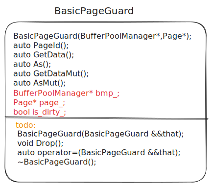

# task#3 Read/Write Page Guards

## 要求

在buffer pool manager中，FetchPage和NewPage函数返回指向pinned page的指针。pinning机制保证page对应frame id不可被淘汰，直到不再有读取和写入操作。为了告诉内存不再需要该page，程序员需要手动调用UnpinPage。

另一方面，如果程序员忘记调用UnpinPage，那么page将永远不会被逐出buffer pool。由于buffer pool实际上以很少的frames运行，因此将有更多的page id做写入写出操作。不仅性能受到影响，而且很难检测到该错误。

你将实现BasicPageGuard：该函数存储指向BufferPoolManager和Page对象的指针。一个page guard确保UnpinPage在相应Page对象离开范围后立即进行调用。请注意，它仍应公开程序员手动取消固定页面的方法。

由于BasicPageGuard隐藏了底层Page指针，它还可以提供只读/写数据API。这些API提供编译时检查以确保为每个用例设置正确is\_dirty\_。

在未来的项目中，同一pages将会有多个线程进行读取和写入，因此需要读写锁来确保数据的正确性。请注意，在Page类中，有用于此目的的相关锁方法。与unpin一个page类似，程序员在使用后可能会忘记取消锁定页面。为解决此问题，你将实现ReadPageGuard和WritePageGuard，在离开范围时立即解锁页面。

你需要为BasicPageGuard、WritePageGuard和ReadPageGuard实现以下函数：

* `PageGuard(PageGuard &&that)`：移动构造函数
* `operator=(PageGuard &&that)`：移动赋值
* `Drop()`：Unpin或者unlatch
* `~PageGuard()`：析构函数

因为使用新的page guards，需要在buffer pool manager中实现以下wrappers：

* `FetchPageBasic(page_id_t page_id)`
* `FetchPageRead(page_id_t page_id)`
* `FetchPageWrite(page_id_t page_id)`
* `NewPageGuard(page_id_t *page_id)`

更多的规范需要阅读头文件(`lru_k_replacer.h,buffer_pool_manager.h,page_guard.h`)。

## BasicPageGuard类

<figure><figcaption><p>BasicPageGuard</p></figcaption></figure>

### BasicPageGuard(BasicPageGuard &\&that)

```cpp
/** TODO(P1): Add implementation
*
* @brief Move constructor for BasicPageGuard
*
* When you call BasicPageGuard(std::move(other_guard)), you
* expect that the new guard will behave exactly like the other
* one. In addition, the old page guard should not be usable. For
* example, it should not be possible to call .Drop() on both page
* guards and have the pin count decrease by 2.
*/
/*移动构造*/
BasicPageGuard(BasicPageGuard &&that) noexcept;
```

`@brief:`

* BasicPageGuard的移动构造函数。
* 当你调用BasicPageGuard(std::move(other\_guard))时，你要令new guard表现得与另一个一样。另外，旧的page guard应该不可用。例如，它应该不能被调用。Drop()应在两个page guard中都被调用且pin count应减少2。

思路：

若this非空，先对其Drop()。将that的page\_，bmp\_,is\_dirty\_移到this，再将that置空。

## Drop()

```cpp
/** TODO(P1): Add implementation
*
* @brief Drop a page guard
*
* Dropping a page guard should clear all contents
* (so that the page guard is no longer useful), and
* it should tell the BPM that we are done using this page,
* per the specification in the writeup.
*/
void Drop();
```

`@brief:`

* Drop一个page guard。
* Drop操作应clear所有内容（因此page guard不再可用），并且它应该告诉BPM我们正在使用该page。

先调用bpm\_->Unpin(..)释放pin\_count\_，再将is\_dirty\_,bpm\_,page\_置空。

## operator=(BasicPageGuard&&)

```cpp
/** TODO(P1): Add implementation
*
* @brief Move assignment for BasicPageGuard
*
* Similar to a move constructor, except that the move
* assignment assumes that BasicPageGuard already has a page
* being guarded. Think carefully about what should happen when
* a guard replaces its held page with a different one, given
* the purpose of a page guard.
*/
/*移动赋值*/
auto operator=(BasicPageGuard &&that) noexcept -> BasicPageGuard &;
```

`@brief:`

* BasicPageGuard的移动赋值函数。
* 与移动构造函数类似，除了移动赋值函数假设BasicPageGuard已经有一个page处于guarded。仔细考虑一个guard如何替代它的page。

只有在this和\&that不同时才操作，返回\*this。

