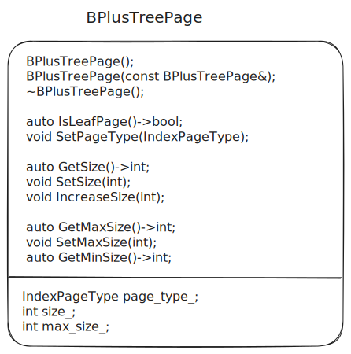
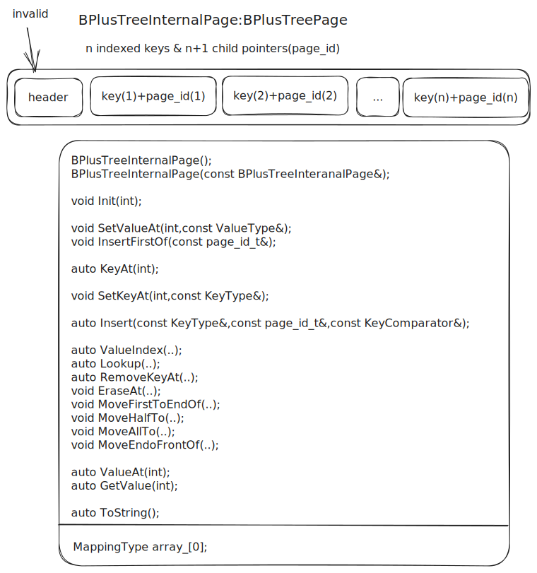
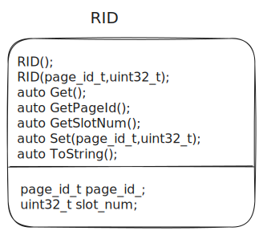
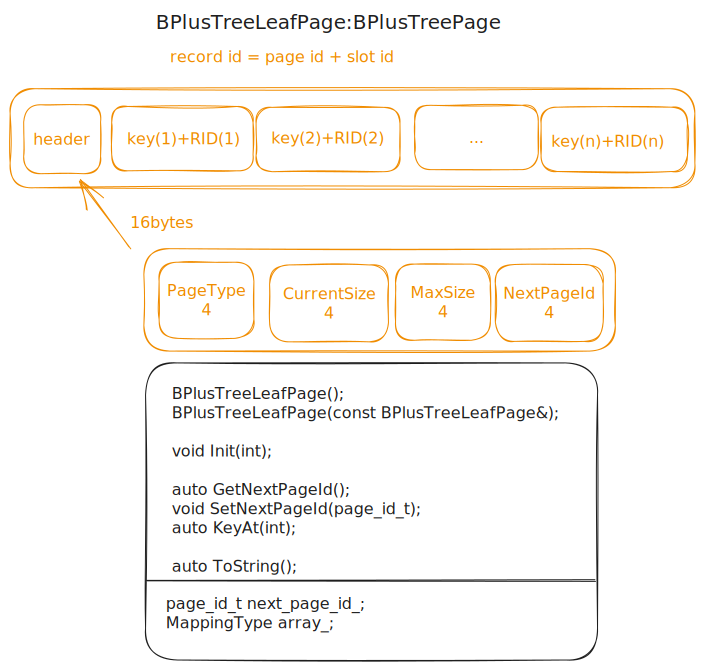

# task#1 B+ Tree Pages

## 要求

你必须实现三个Page类来存储B+树的数据。

* [B+Tree Page B+树页面](https://15445.courses.cs.cmu.edu/spring2023/project2/#b+tree-page)
* [B+Tree Internal Page B+树内部页面](https://15445.courses.cs.cmu.edu/spring2023/project2/#b+tree-internal-page)
* [B+Tree Leaf Page B+树叶页面](https://15445.courses.cs.cmu.edu/spring2023/project2/#b+tree-leaf-page)

### B+ Tree Page

这是内部页和叶子页所继承的基类，并且仅包含两个子类共享的信息。B+树具有以下字段：

```
变量名                    大小                描述
page_type_page_type_     4        page类型（internal或leaf）
size_                    4        page中的键值对数
max_size_                4        page中键值对的最大数量
```

你必须通过仅修改头文件（`src/include/storage/page/b_plus_tree_page.h`）和源文件（`src/storage/page/b_plus_tree_page.cpp`）来实现相应的B+树page。

### B+ Tree Internal Page

Internal page存储了m个有序的键和m+1个指向其他B+树的孩子指针（作为page\_id）。这些键和指针在内部以key/page\_id对的形式表示。由于指针的数量不等于键的数量，因此第一个键被设置为invalid，查找操作应从第二个键开始。

在任何时候，每个internal page都应该半满。在删除操作中，可以合并两个半满的page，或者重新分配键和指针避免合并。在插入操作中，可以将一个满页分割成两个，或者重新分配键和指针以避免分割。这些都是在实现B+树时需要进行的许多设计选择的示例。

你必须通过仅修改头文件（`src/include/storage/page/b_plus_tree_internal_page.h`）和源文件（`src/storage/page/b_plus_tree_internal_page.cpp`）来实现相应的B+树internal page。

### B+ Tree Leaf Page

叶子页存储了m个有序的键和它们对应的m个值。在你的实现中，值应该始终是64位的记录ID（record\_id），用于指示实际元组存储的位置。可以参考`src/include/common/rid.h`中的RID类。叶子页和内部页在键值对的数量上有相同的限制，并且应该遵循相同的合并、分割和重新分配键的操作。

你必须通过仅修改头文件（`src/include/storage/page/b_plus_tree_leaf_page.h`）和源文件（`src/storage/page/b_plus_tree_leaf_page.cpp`）来实现相应的B+树internal page。

注意：尽管叶子页和内部页包含相同类型的键，但它们的值类型可能不同。因此，它们的最大大小（max\_size）可以不同。

每个B+树的叶子页和内部页对应于由缓冲池获取的内存页的内容（data\_）。每当你读取或写入一个叶子页或内部页时，你必须首先冲缓冲池获取该页（使用page\_id），然后将其重新解释为叶子页或内部页，并在读取或写入完成后取消固定该页。

## B+ Tree Page

<figure><figcaption><p>b_plus_tree_page.h</p></figcaption></figure>

按照说明完成源文件里的函数即可。特别地，`BPlusTreePage::GetMinSize()`函数返回`min_size`，若是`internal page`，返回`(max_size_+1)/2`；若是`leaf page`，返回`max_size_/2`。

## B+ Tree Internal Page

<figure><figcaption><p><code>b_plus_tree_internal_page.h</code></p></figcaption></figure>

## B+ Tree Leaf Page

<figure><figcaption><p><code>rid.h</code></p></figcaption></figure>

<figure><figcaption><p><code>b_plus_tree_leaf_page.h</code></p></figcaption></figure>
