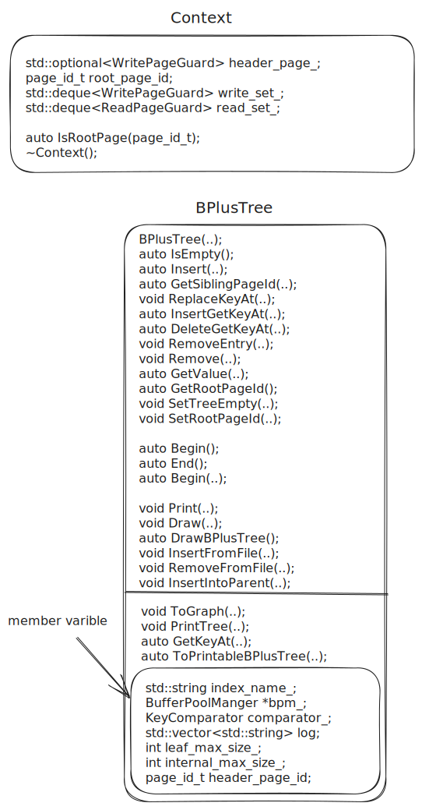
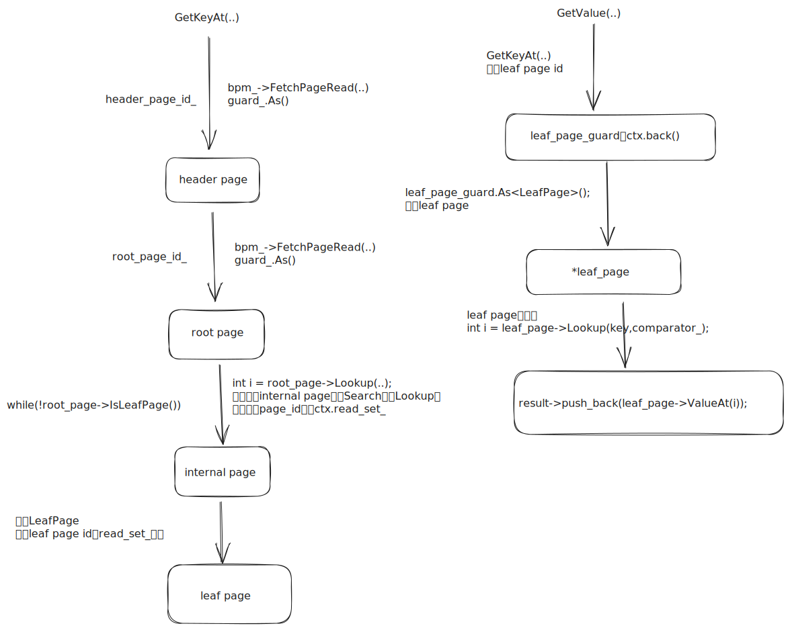
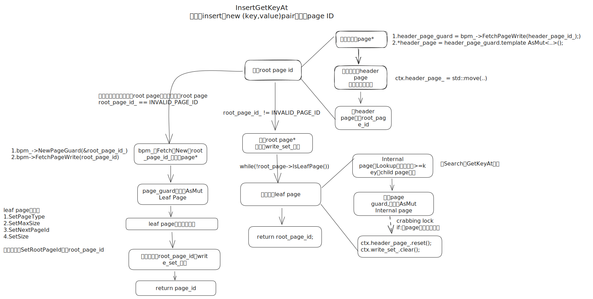
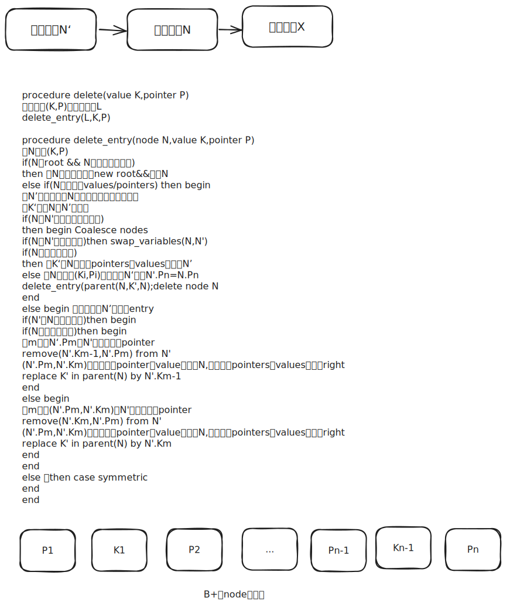
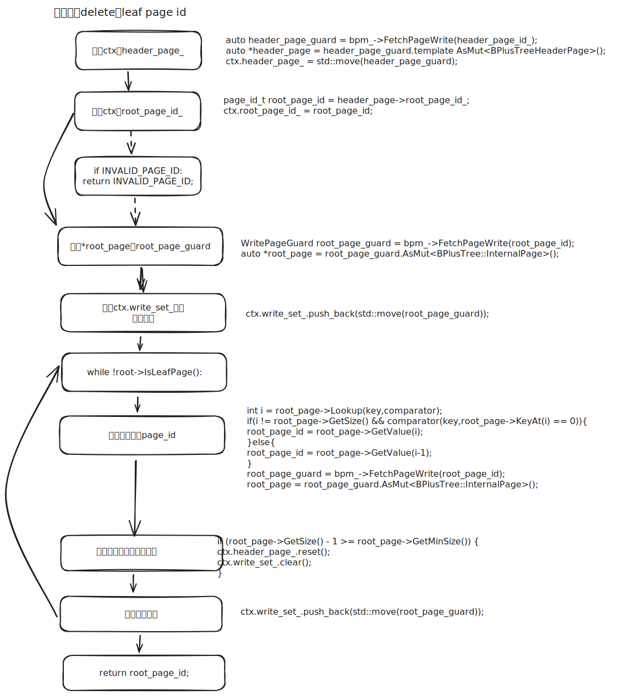
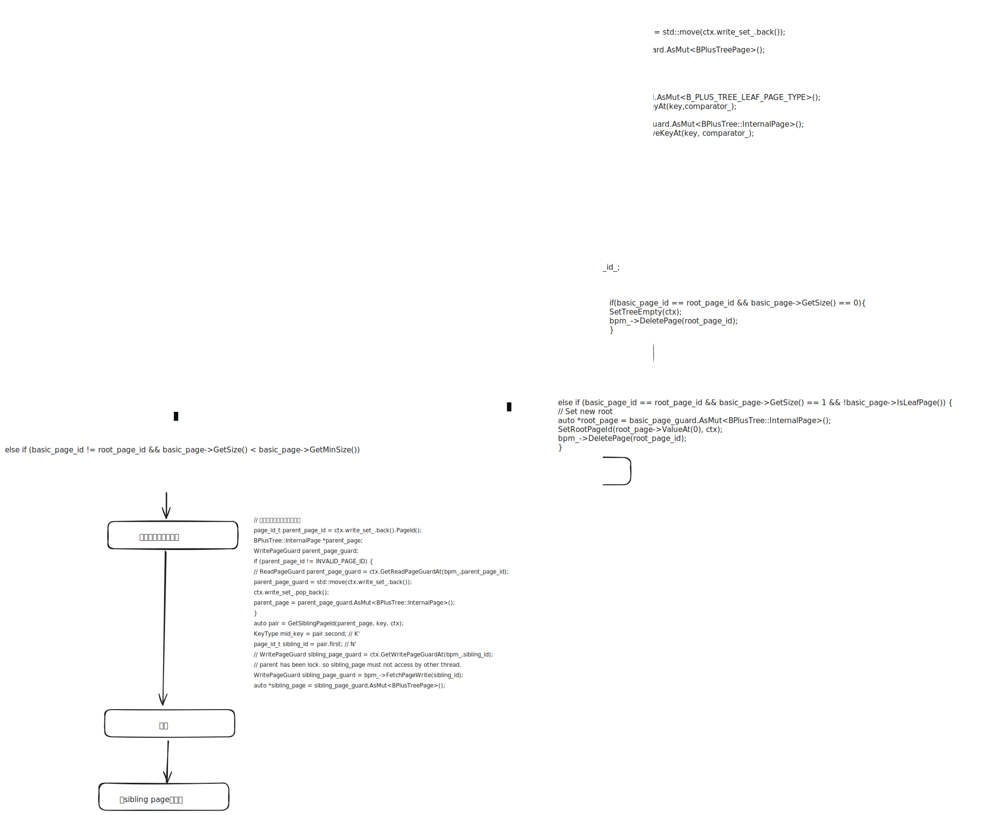

# task#2 B+ Tree Insertion & Search & Deletions for Single Values

## task#2a要求

对于checkpoint#1，你的B+树索引必须支持单个值的插入(Insert())和搜索(GetValue())。该索引应只支持唯一键；如果尝试重新插入已存在的键到索引中，它不应执行插入操作，并返回false（重复key返回false）。

如果插入操作违反了B+树的不变性，应该对B+树的页进行分割（或重新分配键）。如果插入操作导致根页的page id发生变化（插入分裂，树的层数增加），你必须更新B+树索引的头页中的`root_page_id`。你可以通过访问构造函数中提供的`header_page_id_`来完成这个操作。然后，通过使用reinterpret\_cast，你可以将该页强转为`BPlusTreeHeaderPage`(from `src/include/storage/page/b_plus_tree_header_page.h`)，并且从哪里更新根页的page id。你还必须实现`GetRootPageId`方法，该方法当前默认返回0。

我们建议你使用project#1的page guard类来帮助处理同步问题。对于这个checkpoint，我们建议在访问页面时使用`FetchPageBasic`(defined in `src/include/storage/page/`)。当你稍后在task#4中实现并发控制时，可以根据需要将其更改为使用`FetchPageRead`和`FetchPageWrite`。

你可以选择使用Context类(defined in `src/include/storage/index/b_plus_tree.h`)来跟踪你已读取或写入的page（via the `read_set_` and `write_set_` fields），或者存储其他需要递归传递到其他函数中的元数据。

如果你正在使用`Context` class，以下是一些建议：

* 你可能只需要在插入和删除时使用 `write_set_` 。根据你的实现方式，可能不需要使用`read_set_`。
* 你可能希望在Context中存储root page的page id，并在修改B+树时获取header page的write guard。
* 要找到当前节点的父节点，可以查看`write_set_`的末尾，它应该包含沿访问路径的所有节点。
* 你应该使用`BUSTUB_ASSERT`来帮助你找到实现中的不一致数据。例如，如果你要拆分一个节点（除了根节点），你可能希望确保`write_set_`中仍然至少有一个节点。如果你需要拆分根节点，你可能还希望检查`header_page_`是否为`std::nullopt`。
* 要解锁header page，只需将`header_page_`设置为`std::nullopt`。要解锁其他页面，从`write_set_`中pop并drop。

B+树是基于任意key、value和key comparator类型进行参数化的。我们定义了一个宏`INDEX_TEMPLATE_ARGUMENTS`，用于为你生成正确的模板参数声明。

```cpp
template<typename KeyType,
        typename ValueType,
        typename KeyComparator
>
```

这些参数类型包括：

* `KeyType`: index中每个key的类型。实际上，这将是一个`GenericKey`。`GenericKey`的实际大小是可变的，并且由其自己的模板参数指定，该参数取决于索引属性的类型。
* `ValueType`: index中每个value的类型。实际上，这将是一个64位的RID。
* `KeyComparator`: 一个用于比较两个`KeyType`实例之间大小的比较器类。这些类将包含在`KeyType`的实现文件中。

注意：我们的B+树函数还接受一个默认值为nullptr的Transaction\*参数。这是为了project#4准备的，如果你想在并发控制中实现并发索引查找，可以使用该函数。在本项目中，通常不需要使用该参数。

## 前置知识

* [参考笔记（柔性数组&索引\&API流程）](https://zhuanlan.zhihu.com/p/580014163)
* [B+树（查找&插入&删除）](https://zhuanlan.zhihu.com/p/149287061)
* 进阶阅读：[MySQL索引背后的数据结构及算法原理](https://link.zhihu.com/?target=http%3A//blog.codinglabs.org/articles/theory-of-mysql-index.html)&#x20;

## 搜索Search

阅读`src/include/storage/index/b_plus_tree.h`。

```cpp
/**
* b_plus_tree.h
*
* Implementation of simple b+ tree data structure where internal pages direct
* the search and leaf pages contain actual data.
* (1) We only support unique key
* (2) support insert & remove
* (3) The structure should shrink and grow dynamically
* (4) Implement index iterator for range scan
*/
```

实现一个简单的B+树，它的internal page处理搜索，它的leaf page包含实际数据。

* 我们仅支持unique key
* 支持insert\&remove
* B+树应该动态收缩和增长
* 实现可范围搜索的index iterator

<figure><figcaption><p><code>b_plus_tree.h</code></p></figcaption></figure>

* `Context`类用到了C++17的新特性`std::optional`，该成员变量需要调用`optional`的`reset`方法析构（或者重置为`std::nullopt`）。
* `Context`类补充一个析构函数，用于释放四个成员变量（`Context`注释中要求）。`deque`成员需要`clear`析构。
* `Context`类用于保存Search过程中访问过的page及其相关信息。

### auto IsEmpty()->bool

先获取root page的只读guard。再调用guard\_.As()，实际上是reinterpret\_cast强转为BPlusTreeHeaderPage。最后判断root\_page\_id\_是否无效。

```cpp
ReadPageGuard header_page_guard = bpm_->FetchPageRead(header_page_id_);
auto *header_page = header_page_guard.As<BPlusTreeHeaderPage>();
```

### GetValue

```cpp
/*****************************************************************************
* SEARCH
*****************************************************************************/
/*
* Return the only value that associated with input key
* This method is used for point query
* @return : true means key exists
*/
INDEX_TEMPLATE_ARGUMENTS
auto BPLUSTREE_TYPE::GetValue(const KeyType &key, std::vector<ValueType> *result, Transaction *txn) -> bool {
  // Declaration of context instance.
  Context ctx;
  (void)ctx;
  return false;
  
}
```

Search:

* 返回与input key关联的value
* 该方法用于point query
* `@return`:当key存在返回true

<figure><figcaption><p><code>GetValue</code></p></figcaption></figure>

GetValue有三个入参(\&key,\*result,\*txn)，并给定了一个上下文`Context`:

```cpp
Context ctx;
(void)ctx;
```

观察`BPlusTree`的成员函数：

```cpp
// member variable
std::string index_name_;
BufferPoolManager *bpm_;
KeyComparator comparator_;
std::vector<std::string> log;  // NOLINT
int leaf_max_size_;
int internal_max_size_;
page_id_t header_page_id_;
```

`Context ctx`的成员变量：

```cpp
// When you insert into / remove from the B+ tree, store the write guard of header page here.
// Remember to drop the header page guard and set it to nullopt when you want to unlock all.
std::optional<WritePageGuard> header_page_{std::nullopt};

// Save the root page id here so that it's easier to know if the current page is the root page.
page_id_t root_page_id_{INVALID_PAGE_ID};

// Store the write guards of the pages that you're modifying here.
std::deque<WritePageGuard> write_set_;

// You may want to use this when getting value, but not necessary.
std::deque<ReadPageGuard> read_set_;

auto IsRootPage(page_id_t page_id) -> bool { return page_id == root_page_id_; }
```

`GetValue`的大致思路：

利用`BPlusTree`成员变量`header_page_id_`从`bpm_`中`FetchPageRead`获取对应的page guard，然后利用`guard_.As()`强转为`BPlusTreeHeaderPage`。因为可以利用`BPlusTreeHeaderPage`的成员变量`root_page_id_`：

```cpp
class BPlusTreeHeaderPage {
 public:
  // Delete all constructor / destructor to ensure memory safety
  BPlusTreeHeaderPage() = delete;
  BPlusTreeHeaderPage(const BPlusTreeHeaderPage &other) = delete;

  page_id_t root_page_id_;
};
```

这也是官网要求中的提示：

You can do this by accessing the `header_page_id_` page, which is given to you in the constructor. Then, by using [reinterpret cast ](http://en.cppreference.com/w/cpp/language/reinterpret\_cast), you can interpret this page as a `BPlusTreeHeaderPage` (from src/include/storage/page/b\_plus\_tree\_header\_page.h) and update the root page ID from there.&#x20;

获取到`root_page_id_`后，从`bpm_`中`FetchPageRead`获取对应的page guard，再强转为`InternalPage`。事实上每次获取page\*的步骤如下：

*   先得到page id：一开始在`BPlusTreeHeaderPage`中获取成员变量`root_page_id_`。后续循环找leaf page时，先用自定义函数`Lookup`（自定义hepler method，二分查找找>=key的索引），再通过调用internal page函数`GetValue`获取page id。

    ```cpp
    int i = root_page->Lookup(key,comparator);
    // 找到的key在页面中
    if(i != root_page->GetSize() && comparator(key,root_page->KeyAt(i)) == 0){
      root_page_id = root_page->GetValue(i);
    }else{
      // i == root_page->GetSize()
      // 找到的key大于页面array中所有的key，因此返回最后一个page_id
      root_page_id = root_page->GetValue(i-1);
    }
    ```
*   获取page guard：从`BufferPoolManager`中按指定page id获取page guard：

    ```cpp
    root_page_guard = bpm_->FetchPageRead(root_page_id);
    ```
*   page guard强转为对应page\*：


    ```cpp
    // page guard是leaf page
    auto *leaf_page = leaf_page_gurad.As<LeafPage>();
    // page guard是internal page
    root_page = root_page_guard.As<BPlusTree::InternalPage>();
    ```
*   每次访问一个page guard，都将其放入`ctx.read_set_.back()`，每次访问完毕，都队头出列，最后read\_set\_.back()留下目标leaf page（找leaf page的过程用while循环维护，实现一个自定义helper函数GetKeyAt）

    ```cpp
    ctx.read_set_.push_back(std::move(root_page_guard));
    ctx.read_set_.pop_front();

    auto leaf_page_gurad = std::move(ctx.read_set_.back());
    ctx.read_set_.pop_back();
    ```

最后在leaf page中再次使用自定义函数`Lookup`（自定义hepler method，二分查找找>=key的索引），把所有符合条件的value入result：

```cpp
int i = leaf_page->Lookup(key,comparator_);
bool is_success = false;
// 符合条件的value尽数入resut
if (i >= 0 && i < leaf_page->GetSize() && comparator_(leaf_page->KeyAt(i), key) == 0) {
  BUSTUB_ASSERT(result != nullptr, "result not nullptr");
  result->push_back(leaf_page->ValueAt(i));
  is_success = true;
}
```

其中ValueAt函数返回索引对应的value（leaf page和internal page），需要自定义。

### Lookup

以leaf page为例，用二分查找在当前page中寻找第一个>=key的元素索引，找不到返回`GetSize()`。

```cpp
INDEX_TEMPLATE_ARGUMENTS
auto B_PLUS_TREE_LEAF_PAGE_TYPE::Lookup(const KeyType &key, const KeyComparator &comparator) const -> int {
  int left = 0;
  int right = GetSize()-1;
  int ans = GetSize();
  while(left <= right){
    int mid = (left + right) >> 1;
    if(comparator(array_[mid].first,key) >= 0){
      right = mid-1;
      ans = mid;
    }else{
      left = mid + 1;
    }
  }
  return ans;
}
```

## 插入Insertion

### InsertGetKeyAt

<figure><figcaption><p><code>InsertGetKeyAt</code></p></figcaption></figure>

自定义hepler函数，类似Search中的`GetKeyAt`。

### InsertIntoParent

<figure><figcaption><p>InsertIntoParent</p></figcaption></figure>

## 删除Remove

使用查找方法，去找到需要删除的叶子节点。如果有多个相同key-value，则需要找到所有的目标直到我们找到需要删除的位置entry为止。接着把该entry从叶子节点中删除。接着把删除位置右边的entry向左平移一个位置。（普通删除，该节点的kv数不过少，删除不需要额外操作）

1. 从根往叶子查找
2. 找到叶子对应的位置删除entry
3. 删除位置右边的元素全部左移一位

&#x20;如果删除后节点kv数过少，需要及逆行重分配：

1. 从左邻居末尾获取一个元素放到自身的头部
2. 如果是叶子直接放，更新父节点
3. 非叶子，父节点降下来再放，更新父节点

<figure><figcaption><p>伪代码</p></figcaption></figure>

<figure><figcaption><p>Remove</p></figcaption></figure>

### DeleteGetKeyValue

<figure><figcaption><p>DeleteGetKeyValue</p></figcaption></figure>

### RemoveEntry

<figure><figcaption><p>RemoveEntry</p></figcaption></figure>

