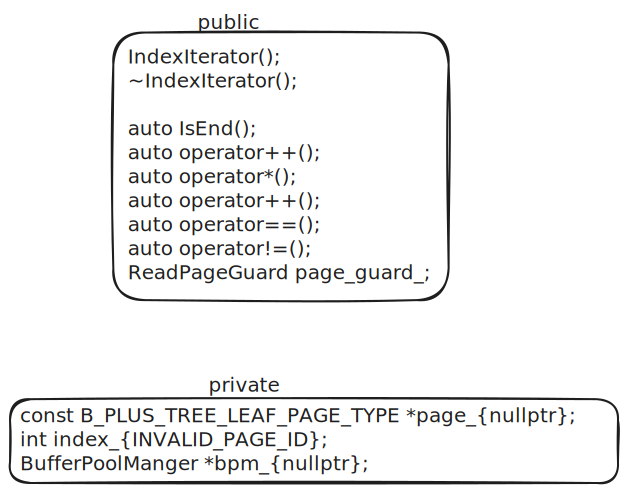

# task#3 An Iterator for leaf scans

## 要求

在完成task#1和task#2中的B+树的实现和全面测试之后，你必须添加一个支持按顺序扫面叶子页面的C++迭代器。基本思想是存储兄弟指针，以便你可以高效地遍历叶子页面。然后实现一个迭代器，按顺序遍历每个叶子页面中的键值对。

你的迭代器必须按照[C++17](https://cplusplus.com/reference/iterator/)风格实现，至少包含以下方法：

1. `isEnd()`返回此迭代器是否指向最后一个键值对。
2. `operator++()`移动到下一个键值对。
3. `operator*()`返回此迭代器当前指向的键值对。
4. `operator==()`返回两个迭代器是否相等。
5. `operator!=()`返回两个迭代器是否不相等。

你的`BPlusTree`还必须实现`begin()`和`end()`方法，以支持在索引上使用C++的for-each循环功能。

## 需要修改的文件

* `src/include/storage/index/index_iterator.h`索引头文件
* `src/index/storage/index_iterator.cpp`相应的源文件
* `src/index/storage/b_plus_tree.cpp`

## `index_iterator.h`

<figure><figcaption>
<code>index_iterator.h</code>
</figcaption></figure>

## 思路与注意事项

* `operator++()`指定迭代器的起点，通过自增移动当前的下标，依次获取对应的结果。每次返回都是一个KV键值对`INDEXITERATOR_TYPE`。如果移动到新页面，`index_`从0开始。
* 操作对象
  1. `leaf_page__`叶子页面
  2. `index_`当前下标。指page\_页内的偏移而不是全局下标。
  3. `bpm_`缓冲池。叶子页面有一个指向右兄弟的指针PageId类型，需要缓冲池进行获取。
  4. `ReadPageGuard`缓冲池的只读页面守卫
* index\_为-1时是终止位置，此时page和bpm\_为空。
* 跨页面遍历时，需要通过缓冲池获取新页面。
* Begin有两种实现：
  1. 无参函数：从最左边开始遍历
  2. 有参函数：从给定key所在位置开始遍历

