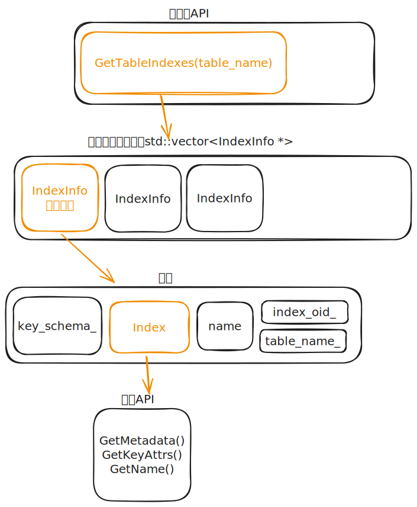

# task#1 Access Method Executors

## 要求

在此任务中，你将实现读取和写入存储系统中表的执行程序。你将在以下文件中完成实现：

* `src/include/execution/seq_scan_executor.h`
* `src/execution/seq_scan_executor.cpp`
* `src/include/execution/insert_executor.h`
* `src/execution/insert_executor.cpp`
* `src/include/execution/update_executor.h`
* `src/execution/update_executor.cpp`
* `src/include/execution/delete_executor.h`
* `src/execution/delete_executor.cpp`
* `src/include/execution/index_scan_executor.h`
* `src/execution/index_scan_executor.cpp`

下面将介绍这些执行程序中的每一个。

<figure><figcaption><p>类图</p></figcaption></figure>

示例可以在[官方shell](https://15445.courses.cs.cmu.edu/spring2023/bustub/)中尝试。

## SeqScan 顺序扫描

`SeqScanPlanNode`可以使用`SELECT * FROM table`语句进行计划。

```sql
bustub> CREATE TABLE t1(v1 INT, v2 VARCHAR(100));
Table created with id = 15
bustub> EXPLAIN (o,s) SELECT * FROM t1;
=== OPTIMIZER ===
SeqScan { table=t1 } | (t1.v1:INTEGER, t1.v2:VARCHAR)
```

SeqScanExecutor迭代遍历表格并逐个返回其元组。

提示：

* 确保你理解在使用`TableIterator`对象时，使用前++和后++运算符之间的区别。如果你混淆了`++iter`和`iter++`，可能会得到奇怪的输出。
* 不要发出在TableHeap中删除的元组。检查每个元组的相应`TupleMetais_deleted_` 字段。
* 顺序扫描的输出是每个匹配元组及其原始记录标识符RID的副本。
* BusTub不支持DROP TABLE或者DROP INDEX。你可以通过重新启动shell来重置shell。

### 目标文件

* `bustub/src/include/execution/executors/seq_scan_executor.h`
* `bustub/src/execution/seq_scan_executor.h`

### 思路

* 目标：遍历一张表，并将表里的数据依次返回给调用者
* 构造函数入参：上下文信息exec\_ctx，要执行的节点plan
* SeqScanExecutor::Init() 初始化函数
  1. 获取table\_oid\_t tid 将要被扫描的表id
  2. 获取TableInfo \*table\_info\_ 获取表的meta<-获取表的catalog<-上下文信息
  3. MakeIterator()设置迭代器
* Next 根据给定的tuple和rid遍历表
  1. 找到要操作的表和迭代器
  2. 移动迭代器获取相应的tuple\&rid
  3. 跳过已被删除的tuple

## Insert 插入

`InsertPlanNode`可以使用`INSERT`语句进行计划。请注意，你需要使用单引号来指定`VARCHAR`值。

```sql
bustub> EXPLAIN (o,s) INSERT INTO t1 VALUES (1, 'a'), (2, 'b');
=== OPTIMIZER ===
Insert { table_oid=15 } | (__bustub_internal.insert_rows:INTEGER)
  Values { rows=2 } | (__values#0.0:INTEGER, __values#0.1:VARCHAR)
```

将InsertExecutor元组插入到表中并更新任何受影响的索引。它正好有一个子级生成要插入到表中的值。规划器将确保值与表具有相同的架构。执行器将生成一个整数类型的元组作为输出，指示已插入表的行数。如果存在与之关联的索引，请记住在插入表时更新索引。

* 插入table
* 更新被影响的索引
* 有一个产生值的孩子
* 计划器保证所有的值有相同的schema
* 执行器会产生一个整数类型的tuple作为输出，用于表示往表中插入了多少行数据
* 记住插入数据后要更新索引

提示：

* 参照系统表System Catalog部分，初始化时，你需要查找表相关的信息。
* 查看索引更新Index Updates部分，光宇更新表的索引。
* 你需要使用堆表TableHeap类去执行表的修改。
* 当你创建或者修改TupleMeta元组数据时，你只需要修改`is_delete_`字段。对于`insertion_txn_`和`deletion_txn_`字段，只需要设置为`INVALID_TXN_ID`。

### 目标文件

* `bustub/src/include/execution/executors/insert_executor.h`
* `bustub/src/execution/insert_executor.h`

### 思路

* 先从子节点获取插入的数值
* 依次插入到对应的表中
* 记录成功的条数，返回给调用者

## Update 更新

`UpdatePlanNode`可以用`UPDATE`句段来计划。它只有一个子节点，其中包含要在表中更新的记录。

```sql
bustub> explain (o,s) update test_1 set colB = 15445;
=== OPTIMIZER ===
Update { table_oid=20, target_exprs=[#0.0, 15445, #0.2, #0.3] } | (__bustub_internal.update_rows:INTEGER)
  SeqScan { table=test_1 } | (test_1.colA:INTEGER, test_1.colB:INTEGER, test_1.colC:INTEGER, test_1.colD:INTEGER)
```

`UpdateExecutor`修改指定表中的现有元组。执行器将生成一个整数类型的元组作为输出，表示已更新的行数。**请记得更新受更新影响的任何索引。**

提示：

* 要实现更新操作，首先**删除受影响的元组**，然后**插入一个新的元组**。除非你正在为project#4实现排行榜优化，否则不要使用`TableHeap`的`UpdateTupleInplaceUnsafe`函数。

总结：

* 更新元组的元数据
* 覆盖已有数据的值
* 索引更新

<figure><figcaption><p>索引类图</p></figcaption></figure>

* 操作时拿到表关联的索引，然后对索引做操作

### 目标文件

* `bustub/src/include/execution/executors/update_executor.h`
* `bustub/src/execution/update_executor.h`

### 思路

* 目标：修改指定表的元组
* 要获取的成员变量：
  1. 要操作的表
  2. 表关联的索引
  3. 该表是否已经执行过的标记
* 步骤：
  1. 删除元组tuple
  2. 插入元组
  3. 更新相关索引：先删除旧索引再插入新索引，孩子节点初始化
  4. 返回更新的函数
* 构造函数 UpdateExecutor ：对成员变量初始化
  1. plan\_
  2. 子执行器child\_executor\_：由于这是独占指针，因此需要std::move转移
* 初始化 Init ：初始化一些未在构造函数初始化的成员变量
  1. table\_id\_
  2. table\_info\_：从系统表中获取
  3. index\_list\_：关联的索引，也从系统表中获取
  4. 子执行器child\_executor\_的初始化：否则可能产生内存泄漏
* Next ：调用后告诉使用者更新了几行数据
  1. 若子执行器为空，直接返回false
  2. while循环，依次调用子节点的Next方法获取有关的tuple
  3. 删除原tuple（meta.is\_delete\_标记为true），meta通过表提供的函数GetTupleMeta获取
  4. 新元组插入，插入前对元素进行更新（Evaluate函数）
  5. 更新索引：删除和插入都只需要部分tuple信息（KeyFromTuple函数）
  6. 记录更新函数

## Delete 删除

DeletePlanNode可以用DELETE语句进行计划。它只有一个子节点，其中包含要从表中删除的记录。你的删除执行器应该生成一个整数输出，表示它从表中删除的行数。它还需要更新任何受影响的索引。

```sql
bustub> EXPLAIN (o,s) DELETE FROM t1;
=== OPTIMIZER ===
Delete { table_oid=15 } | (__bustub_internal.delete_rows:INTEGER)
  Filter { predicate=true } | (t1.v1:INTEGER, t1.v2:VARCHAR)
    SeqScan { table=t1 } | (t1.v1:INTEGER, t1.v2:VARCHAR)

bustub> EXPLAIN (o,s) DELETE FROM t1 where v1 = 1;
=== OPTIMIZER ===
Delete { table_oid=15 } | (__bustub_internal.delete_rows:INTEGER)
  Filter { predicate=#0.0=1 } | (t1.v1:INTEGER, t1.v2:VARCHAR)
    SeqScan { table=t1 } | (t1.v1:INTEGER, t1.v2:VARCHAR)
```

在出现DeleteExecutor的查询计划中，你可以假设DeleteExecutor始终位于根节点。DeleteExecutor不应修改其结果集。

提示：

* 要删除一个元组，你需要从子执行器获取一个RID，并更新该元组对应的TupleMeta中的is\_deleted\_字段。所有的删除操作将在事务提交时应用。

### 目标文件

* `bustub/src/include/execution/executors/delete_executor.h`
* `bustub/src/execution/delete_executor.h`

### 思路

* 目标：从一张表中删除几行满足要求的元组
* 依次实现：构造函数->Init函数（子节点初始化）->Next函数
* Next：返回表中删除的行数
  1. 返回删除的Tuple数量
  2. 循环调用子节点的Next
     1. 标记TupleMeta已删除，并更新数据
     2. 删除相应的索引
  3.
* 成员变量
  1. 操作的表`TableInfo`
  2. 表的索引
  3. 是否已执行Next方法 `bool is_end_`

## IndexScan 索引扫描

IndexScanExecutor是一个遍历索引的操作符，用于检索存储在元组中的RID(记录标识符)。然后，操作符使用这些RID在相应的表中检索它们所对应的元组。它然后逐个发出这些元组。

你可以通过执行`SELECT FROM <table> ORDER BY <index column>`测试索引扫描执行程序。我们将在task#3解释为什么ORDER BY可转换为索引扫描。

```sql
bustub> CREATE TABLE t2(v3 int, v4 int);
Table created with id = 16

bustub> CREATE INDEX t2v3 ON t2(v3);
Index created with id = 0

bustub> EXPLAIN (o,s) SELECT * FROM t2 ORDER BY v3;
=== OPTIMIZER ===
IndexScan { index_oid=0 } | (t2.v3:INTEGER, t2.v4:INTEGER)
```

在这个项目中，计划中索引对象的类型将始终为`BPlusTreeIndexForTwoIntergerColumn`。你可以安全地将其强制转换并存储在执行器中。

```cpp
tree_ = dynamic_cast<BPlusTreeIndexForTwoIntegerColumn *>(index_info_->index_.get())
```

你可以从索引对象构建一个索引迭代器，通过所有键和元组ID进行扫描，从表堆中查找元组，并按照顺序发出所有元组。BusTub仅支持具有单个唯一整数列的索引。我们的测试用例不会包含重复的键。

提示：

* 与上述相同，不要发出已删除的元组。
* 现在你已经实现了所有与存储有关的执行器，你可以自行创建表格并插入值来测试执行器的实现。此时，你应该已经通过了SQLLogicTests#1-#6的测试。
* 我们不会向有索引的表中插入重复的行。

### 目标文件

* `src/include/execution/index_scan_executor.h`
* `src/execution/index_scan_executor.cpp`

### 思路

* 目标：遍历索引，把符合条件的tuple统计出来
* P2中实现了B+树，`BPlusTreeIndex`继承自`Index`
* `BPlusTreeIndexForTwoIntegerColumn`是一种特殊的`BPlusTreeIndex`，`BPlusTreeIndex`是一个模板，`BPlusTreeIndexForTwoIntegerColumn`指定了模板的类型
* 只有`order by`后面的属性类存在索引，走index\_scan，否则走sort
* 如果tuple已删除，跳过
* 成员变量：计划节点plan\_，表的信息TableInfo，索引信息BPlusTreeIndexForTwoIntegerColumn，迭代器BPlusTreeIndexIteratorForTwoIntegerColumn


一些问题：

* Q：索引中存储的内容是什么？
  * A：P2task#3中实现的迭代器，迭代器指向的值是`std::pair<KeyType,ValueType>`类型，即`page_id`和`rid`，通过rid即可获得对应的元组tuple
* Q：`index_scan`和`seq_scan`的异同？
  * A：共同点：
    * 都是select \* from table ...
    * index\_scan和seq\_scan调用Next函数时，都是返回tuple
  *   不同点：

      * index\_scan后面跟一个order by，order by后面的列正好是创建过的索引

