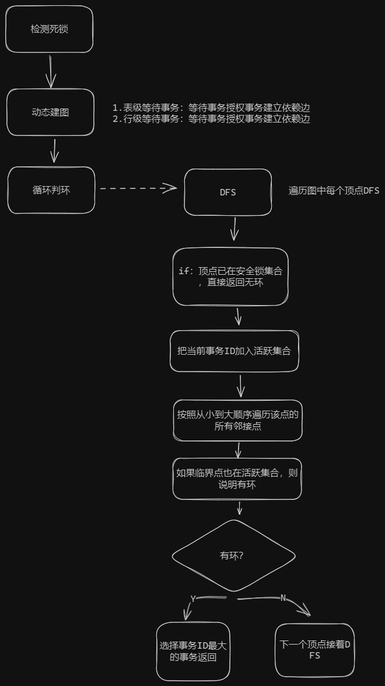

# task#2 Deadlock Detection

## 要求

锁管理器应在后台线程中运行死锁检测，定期构建等待图并根据需要中止事务以消除死锁。

你必须使用以下图API进行循环检测：

* `AddEdge(txn_id_t t1, txn_id_t t2)`:在图形中添加从“t1”到“t2”的边缘，表示“t1”正在等待“t2”。如果边缘已存在，则无需执行任何操作。
* `RemoveEdge(txn_id_t t1, txn_id_t t2)`: 从图形中删除边缘“t1”到“t2”。如果不存在这样的边缘，则无需执行任何操作。
* `HasCycle(txn_id_t& txn_id)`:使用深度优先搜索 （DFS） 查找循环。如果找到一个周期， `HasCycle` 则应将周期中最年轻的事务的交易 ID 存储在 in 中 `txn_id` 并返回 true。函数应返回它找到的第一个周期。如果图形没有循环， `HasCycle` 则应返回 false。
* `GetEdgeList()`: 返回表示图形中边的元组列表。我们将用它来测试图表的正确性。一对 '（t1，t2）' 对应于从 't1' 到 't2' 的边。
* `RunCycleDetection()`: 包含用于在后台运行循环检测的骨架代码。您应该在此处实现循环检测算法。

你可以随心所欲地实现该图，只要你支持上述API。我们将使用该API来测试你的实现。

注意：

* 你的后台线程应该在每次唤醒时使用动态构建图。你不应维护一个持久的图，而是在每次线程唤醒时构建和销毁图。
* 你的DFS环检测算法必须是确定性的。为了实现这一点，你必须始终选择首先探索最低的事务ID。这意味着在选择要从中运行DFS的未探索节点时，始终选择具有最低事务ID的节点。这也意味着在探索邻居时，按从最低到最高的排序顺序探索它们。
* 当你发现一个循环时，你应该通过将最年轻的事务状态设置为ABORTED来中止最年轻的事务，以打破循环。
* 当你的检测线程唤醒时，它负责中断所有存在的环。如果你遵循上述要求，你将始终以确定性顺序找到环。这也意味着在构建图时，你不应添加中止事务的节点，也不应向中止事务绘制边。
* 你的后台循环检测算法可能需要使用txn\_id获取指向事务的指针。我们已经添加了一个静态方法`Transaction* GetTransaction(txn_id_t txn_id)`，以便让你完成这个操作。

总结：

* 动态构建的有向图：定时任务，下一个周期时动态构建图
  * 点：事务ID
  * 边：锁依赖关系
* 箭头指向的顶点表示依赖的事务
* 搜索时从事务编号最小开始搜索
* 有环时中止最年轻的事务，也就是编号最大的事务，因为事务ID递增
* 不能向已终止的事务加边（已终止事务需要删除）

<figure><figcaption>
死锁检测
</figcaption></figure>

